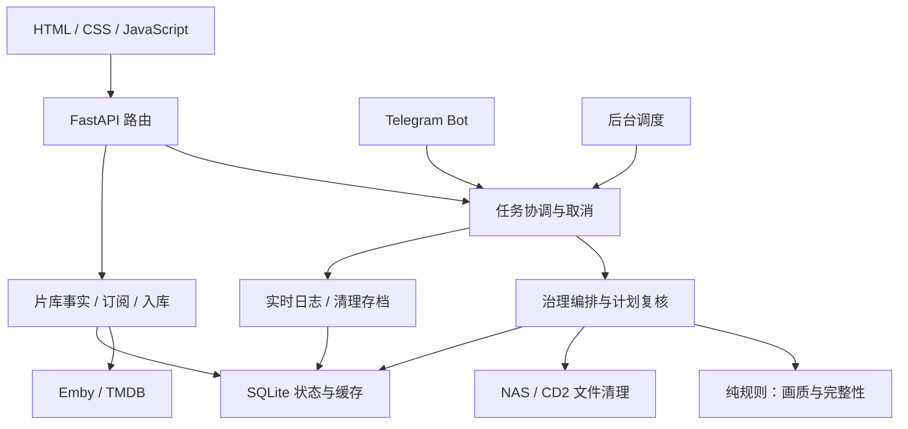

# StrimKeep 1.0.0 架构

单 Docker 容器运行 FastAPI，端口 8321。前端没有构建流程；原生 JavaScript 按显式顺序 defer 加载。SQLite 是配置、缓存、订阅、治理计划及日志唯一写入存储。

| 代码位置 | 职责 |
| --- | --- |
| `app/main.py`、`routers/` | 服务生命周期、静态资源、认证及按页面分组的 HTTP 接口 |
| `app/tasks.py`、`scheduler.py`、`bot.py` | 已注册重任务互斥与取消、定时任务和 Bot |
| `app/engine.py`、`compat.py` | 共享配置、缓存、路径与锁；现有业务及 CLI 名称的兼容入口 |
| `app/domain/quality.py`、`domain/governance.py` | 不依赖 IO 的画质与治理规则 |
| `app/core.py` | 名称、季号、集号解析与规则兼容转发 |
| `app/governance.py`、`plan_guard.py` | 扫描、计划、规则指纹、文件身份复核与执行 |
| `app/lib.py`、`wash.py`、`cloud_residue.py` | STRM 索引、NAS 与 CD2 删除、附属文件及目录处理 |
| `app/morning.py`、`subscribe.py`、`ingest.py`、`stats.py` | 同源片库事实、健康和缺集、订阅变化、入库汇报与晨报 |
| `app/emby.py`、`tmdb.py`、`tg.py` | 外部服务访问 |
| `app/config.py`、`security.py` | 配置与会话、同源校验 |
| `app/storage.py`、`state_store.py` | SQLite 事务、计划、缓存与旧 JSON 一次迁移 |
| `app/runtime_logs.py`、`logger.py`、`storage_status.py` | 滚动运行日志、清理结果存档和存储错误诊断 |
| `static/js/runtime.js`、`modal.js`、`icons.js` | API、任务提示与取消、主题、海报与公共交互 |
| `static/js/dashboard.js`、`dashboard-layout.js` | 总览和顶部运行状态弹层 |
| `static/js/governance.js`、`directory-cleanup.js`、`plans.js` | 治理、目录清理及计划存档 |
| `static/js/mapping.js`、`explore.js` | 片库映射、探索、海报预取与滚动 |
| `static/js/subscriptions.js`、`records.js`、`settings.js` | 订阅、晨报、入库、日志与设置 |
| `static/js/bootstrap.js`、`theme-meta.js` | 初始化与状态栏颜色 |

## 数据与删除边界

`/data/state/strimkeep.db` 保存运行数据。历史 JSON/JSONL 只在第一次迁移时读取，成功标记后不再参与主读或双写。历史必填 `docs.version` 结构兼容升级，未知额外列与已有数据保留。

本地库删除 NAS STRM 和附属文件，并经 CD2 清理对应 115 源及附属文件；分享库只清理 NAS。媒体清理不产生特殊备份。逐季策略仅处理选中季，其他季不动，主目录仅在为空时清理。目录清理跳过有 STRM、视频、未知文件或链接的目录；失败显示原因。

实时日志约保留 10,000 条，日志页面保留最近 500 行并每 2 秒增量刷新；切页或隐藏暂停。治理清理的结构化存档不随实时日志回收。顶部运行状态每 15 秒读取进程内状态，不扫描媒体或探测远端服务。

## 当前边界与后续改进

前后端文件边界已经拆分，但前端全局调用、engine 的共享可变缓存仍存在。任务协调只覆盖已注册重任务，轻量接口与部分后台缓存有自己的刷新逻辑。后续可逐步收拢页面状态和缓存生命周期；不必为了单容器 NAS 工具立即拆微服务。

大库 TMDB 对照时仍会有短期资源占用，缓存聚合后内存是否回落需在真实 NAS 观察。DOM 替身测试不代替手机浏览器视觉验收；实际挂载权限、115 延迟、网络和反代需要部署验证。

## 海报与连续结果流

探索接口分页与可见卡片数量分别管理：按实际列数追加整行，尾部不足一行的条目保留到下一批，只有到最终页才展示真实尾数；跨页按媒体类型与 TMDB 标识去重。已有卡片仅更新变动的状态标记，追加不重建前面的图片。

探索预取下一数据页，并只预热下一屏的最多 12 张图片；省流量模式不主动预热。返回同一筛选在 3 分钟内复用已加载列表、页游标与滚动位置；切页或更换筛选会中止前端旧请求，后台已启动的缓存任务仍按原有时限完成。

公网海报使用浏览器懒加载，屏幕内图片提升加载优先级。鉴权海报在距离屏幕约 600px 内开始加载，页面间共用 6 个加载槽，同一地址合并请求；浏览器缓存定期限制在约 120 张，对象 URL 在加载、解码完成或失败时释放。更换筛选后移除失效的观察节点。

映射读取缓存时保留当前墙，收到新结果后再替换；失败保留旧列表并提示原因，过时请求不能覆盖后来的结果。此轮不改变片库事实统计、TMDB 对照或治理删除逻辑。
